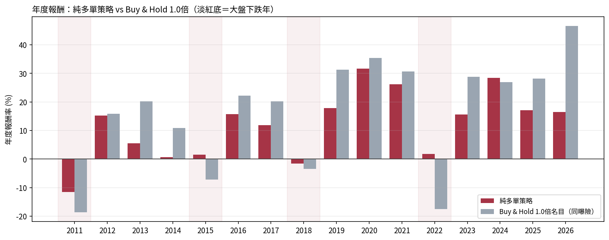
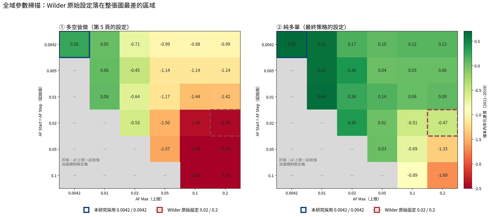
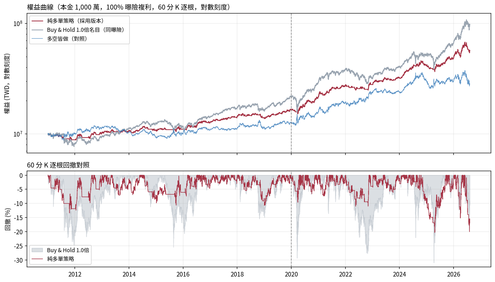
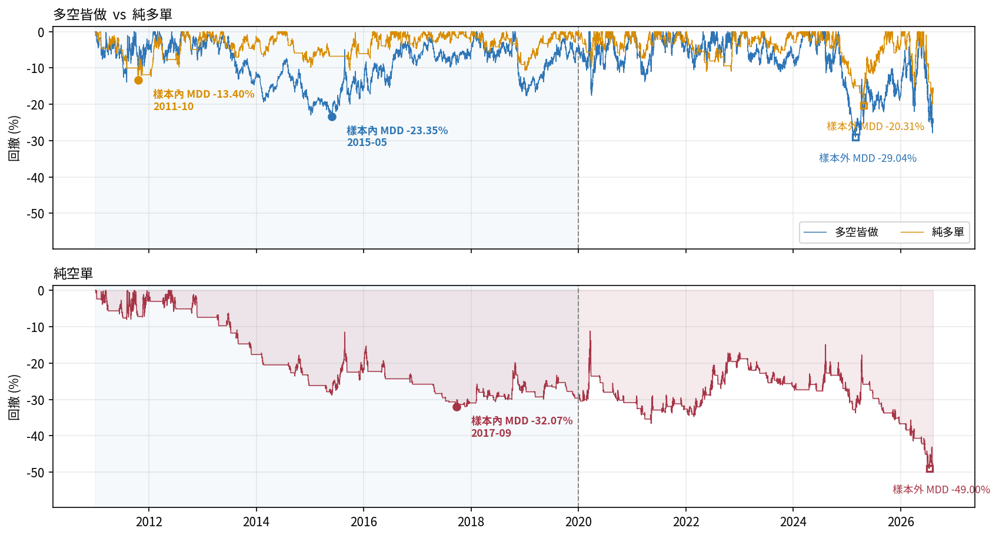
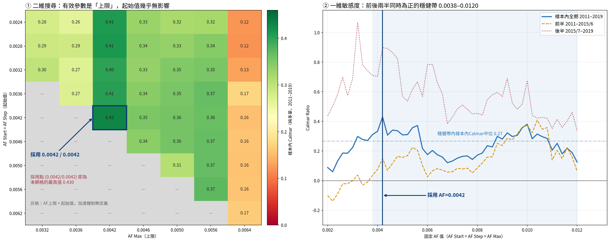

# 拋物線 SAR 順勢交易系統 — 台指期實證研究

> 本研究為 **TMBA（台灣最優質的 MBA 社團）** 量化研究組的簡報專題，作者：王文廣。
> `docs/research-deck.pdf` 為社團簡報成果，圖文著作權歸 TMBA 與作者所有，請勿逕行轉載或改作。

把 J. Welles Wilder (1978) 的 Parabolic SAR 完整實現在台灣股價指數期貨上，
檢驗教科書設定是否可用，並記錄從失敗到可用的完整修正過程。

**一句話結論**：教科書參數在 60 分 K 上會把帳戶打到剩 5%、被交易成本清出市場；
把加速機制關閉、只做多單之後策略成立，但它的價值在風險控制而非報酬追求。

---

## 最終策略

| 項目 | 設定 |
|---|---|
| 商品 | 小型臺指期貨（MXF），每點 50 元 |
| 週期 | 60 分 K，日盤 ＋ 夜盤全日盤 |
| 訊號 | SAR，AF 固定 **0.0042**（起始 ＝ 遞增 ＝ 上限，加速機制關閉） |
| 進場 | SAR 翻多 → 下一根 K 棒開盤買進 |
| 出場 | SAR 翻空 → 下一根開盤平倉，**空手等待、不反手做空** |
| 部位 | 目標曝險 ＝ 當期權益 × 100%，獲利再投入（與 Buy & Hold 同為複利口徑）<br>口數 ＝ 權益 ÷ (指數 × 50)，僅新進場時計算一次、不加減碼 |
| 結算日 | 每月第三個星期三強制平倉且不進場（涵蓋前一晚夜盤） |
| 成本 | 每口來回 600 元（單邊 300） |

### 績效

| 指標 | 樣本內 2011–2019 | 樣本外 2020–2026/08 | 全樣本 |
|---|---|---|---|
| 累積報酬 | 65.41% | 242.78% | **467.13%** |
| 年化報酬 | 5.76% | 20.53% | **11.77%** |
| 最大回撤 | -13.40% | -20.31% | **-20.31%** |
| 年化夏普 | 0.65 | 1.48 | **1.06** |
| Calmar | 0.43 | 1.01 | **0.58** |
| 獲利因子 | 1.64 | 2.34 | **2.02** |
| 交易次數 | 117 | 114 | 230 |

**樣本外的風險調整後表現優於樣本內**（Calmar 0.43 → 1.01）。
但樣本外最大回撤 -20.31% 較樣本內 -13.40% 更深，實務上應以前者為準備水準。

### 與同曝險基準比較

以 1.0 倍名目的 Buy & Hold 為基準（與策略**同曝險、同為複利口徑**，比較才對等）：

| | 策略 | B&H 1.0 倍 |
|---|---|---|
| 年化報酬 | 11.77% | **15.73%** |
| 最大回撤 | **-20.31%** | -30.98% |
| Calmar | **0.58** | 0.51 |
| 年報酬標準差 | **1.71%** | 3.62% |
| 大盤下跌年 | **4 戰 4 勝** | — |



**報酬輸、風險贏。** 策略平均只有 63% 的時間在場，
夏普與獲利因子不受曝險倍數影響（0.2×–2.0× 區間夏普穩定在 1.04–1.07）。

---

## 研究歷程：三個發現

### ① 教科書參數在 60 分 K 上會被交易成本清出市場

Wilder 原始設定（AF 起始／遞增 0.02、上限 0.20）是為**日 K** 設計的。
直接套用到 60 分 K：樣本內 **-94.65%**。複利制下曝險隨權益縮減，帳戶不會歸零，
但樣本內結束時權益僅剩本金的 5.35%，一口小台的名目已超過剩餘資金——
樣本外 6.6 年只成交 **26 筆**（樣本內為 1,631 筆），策略實質上已無法開倉。

原因用「缺口半衰期」看最清楚——停損與極值的距離減半需要幾根 K 棒：

| 設定 | 半衰期 | 換算交易日 |
|---|---|---|
| Wilder 上限 0.2 | **3.1 根** | 0.2 天 |
| Wilder 起始 0.02 | 34.3 根 | 2.7 天 |
| **本研究 0.0042** | **164.7 根** | **13.1 天** |

一段趨勢平均長 **149 根 K 棒**。Wilder 參數在 AF 衝到上限後 3 根就把停損逼近一半，
任何正常回檔都會掃出場——樣本內產生 1,631 筆交易、每筆期望值 **-0.175%**。

全域掃描（`charts/figA2_global_sweep.png`）證明這不是單一參數的運氣問題：
右下角整個「快速 AF」區域全為深度負值，呈單調梯度，**AF 越快越差，無例外**。





### ② 空單承擔最大風險卻是負報酬

**僅使用樣本內資料**判斷（因為「移除空單」是設計決策，用全樣本判斷即等同偷看樣本外）：

| 樣本內 2011–2019 | 多空皆做 | 純多單 | 純空單 |
|---|---|---|---|
| 累積報酬 | 26.25% | **65.41%** | -12.89% |
| 最大回撤 | -23.35% | **-13.40%** | **-32.07%** |
| Calmar | 0.11 | **0.43** | -0.05 |
| 獲利因子 | 1.17 | **1.64** | 0.89 |

純空單承擔全部設定中最深的回撤，報酬卻是負的。
僅移除空單即可使 Calmar 由 0.11 提升至 0.43。此結論在兩組參數下皆成立。



### ③ 加速機制關閉不是預設，是搜出來的結果

二維網格中「起始值」與「上限」分開搜尋，**贏家落在起始 ＝ 上限的對角線上**
（`charts/fig09_parameter_plateau.png`）。

- 決定績效的是**上限**：AF Max = 0.0042 整欄皆 0.40–0.43，其餘欄位多半僅 0.12–0.37
- 起始值幾乎無影響：因遞增值綁定起始值，第一個新極值出現時 AF 即撞上限（中位 1 根 K 棒），
  而趨勢段平均 149 根 —— 起始值只支配部位生命週期的 0.7%
- 附帶好處：模型從 3 個參數降為 **1 個自由參數**，且 `af_step` 變成不可識別

穩健帶（前後兩半 Calmar 皆為正）為 **0.0038–0.0120**，全域無懸崖。



---

## 方法論上的講究之處

**資料**：使用經稽核的分鐘連續月序列（`post` 換月規則、差值調整），已還原換月假跳空。資料本身受供應商授權限制，未隨本倉庫發布。
策略以點數計算損益，故用**差值調整**；Buy & Hold 計算百分比報酬，故用**比例調整**。
（曾誤用差值調整計算 B&H，得到 -69% 的假回撤，已修正。詳見 [DATA.md](DATA.md)）

**參數選擇**：僅使用樣本內資料，經三關檢定——
Calmar 最高（同時也是夏普最高）、每筆期望值與獲利因子具安全邊際、
成本 ×3 時 Calmar 衰減 64%（次佳候選 AF=0.010 衰減 93%）、
樣本內四個大盤下跌年全數優於大盤。

**曝險與複利口徑對齊**：目標曝險固定為權益的 100% 並獲利再投入，
使策略與 Buy & Hold 同為複利口徑。若策略用固定金額而基準複利，
兩者不對等，長期比較會嚴重失真（本研究前一版即有此問題，已修正）。

**逐筆指標 scale-free**：複利下後期交易金額較大，勝率／盈虧比／獲利因子
改以「該筆損益 ÷ 進場時權益」計算，避免後期交易被過度加權。

**回撤口徑統一**：全專案 MDD 一律以 60 分 K 逐根權益計算（比日頻嚴格），
夜盤歸屬次一交易日。

---

## 已知限制

1. **年化 11.77% 低於同曝險 Buy & Hold 的 15.73%**，多頭年份參與度明顯不足：
   大盤上漲的 12 個年度中策略落後 11 年（僅 2024 年小勝）。
2. **樣本外回撤較樣本內更深**（-20.31% vs -13.40%）。相對排序（純多 < 多空 < 純空）
   在樣本外維持不變，但絕對回撤水準不應假設樣本外不會超過樣本內。
3. **防禦來自「參與度低」而非「不對稱曝險」**。上漲日 beta 0.32、下跌日 0.23，
   僅 1.43 倍；極端日甚至略為不利（吃到最好 20 日的 17%、最糟 20 日的 19%）。
4. **回測未給閒置資金計息**。保證金佔用中位約 133 萬，
   實務上大部分資金可另生利息，故報酬應視為下限。
5. **樣本內僅 9 年**（小台連續月序列自 2011-01-03 起）。
6. **切點敏感度**：樣本內／樣本外的分界若改動，選出的 AF 會在 0.0042 與 0.0100 之間跳動
   （兩者樣本內 Calmar 僅差 0.02）。六種切點下樣本外皆為正（夏普 1.07–1.67），
   但真正的結論是「AF 落在 0.004–0.010 區間皆可用」，而非「0.0042 是唯一解」。
7. **尚未做跨商品外部驗證**。

---

## 專案結構

```
├── src/                    核心模組
│   ├── config.py             全域設定（商品、資金、成本、參數、期間）
│   ├── sar.py                Parabolic SAR 指標
│   ├── settlement.py         結算日判定
│   ├── backtest.py           回測引擎
│   └── report.py             績效指標
├── scripts/
│   ├── 00_make_sample_data.py  產生合成示範資料（非市場資料）
│   ├── 01_build_data.py      從原始 parquet 建立回測輸入檔
│   ├── 02_run_backtest.py    產生所有績效數字
│   ├── 03_param_search.py    參數搜尋（僅用樣本內）
│   └── 04_make_charts.py     產生所有圖表
├── data/                   回測輸入（**刻意留空**，見 data/README.md）
├── charts/                 圖表
├── docs/research-deck.pdf        完整研究簡報
└── DATA.md                 資料來源、處理步驟與重建規格
```

`results/` 為腳本輸出，未進版控（執行 `scripts/02` 與 `scripts/03` 後自動產生）。

## 重現步驟

```bash
pip install -r requirements.txt

# 1. 建立回測輸入檔（必要步驟——本專案不隨附資料）
#    (a) 已取得授權資料：
python scripts/01_build_data.py /path/to/MTX_continuous_1m_post.parquet
#    (b) 僅想確認程式可執行（產生合成資料，數字不具研究意義）：
python scripts/00_make_sample_data.py

# 2. 產生所有績效數字
python scripts/02_run_backtest.py

# 3. 參數搜尋（約數分鐘）
python scripts/03_param_search.py

# 4. 產生圖表
python scripts/04_make_charts.py
```

### ⚠️ 本專案不隨附任何回測資料

原始 1 分鐘序列彙整自 **啟書（qishu）** 與 **TOUCHANCE** 兩家商業資料供應商，
授權不允許再散布。由其重新取樣而得的 60 分 K 序列在實質上可替代原始資料，
因此**同樣不發布**——`data/` 目錄刻意留空。

要重現簡報中的數字，請自行取得同規格的授權資料後執行 `scripts/01_build_data.py`，
或依 [DATA.md](DATA.md) 第四節的規格自建等效序列。完整說明見 [data/README.md](data/README.md)。

本倉庫發布的是**方法與程式碼**，以及圖表、績效統計等聚合結果；
這些聚合結果無法還原出原始序列，不構成資料再散布。

---

## 授權

程式碼採 MIT 授權（見 [LICENSE](LICENSE)）。
本授權僅涵蓋程式碼與文件。研究所使用的市場資料未包含在本倉庫內，
其權利歸原資料供應商（啟書、TOUCHANCE）所有；取得與使用該資料須遵循各供應商的授權條款。

`docs/research-deck.pdf` 為 **TMBA（台灣最優質的 MBA 社團）** 之簡報成果，
其圖文著作權歸 TMBA 與作者王文廣所有，**不適用 MIT 授權**，請勿逕行轉載或改作。

本專案為 TMBA 學術研討資料，僅供研究與教學用途，不構成投資建議；
TMBA 無須對投資損益負責，投資人應審慎考量各種投資風險。
